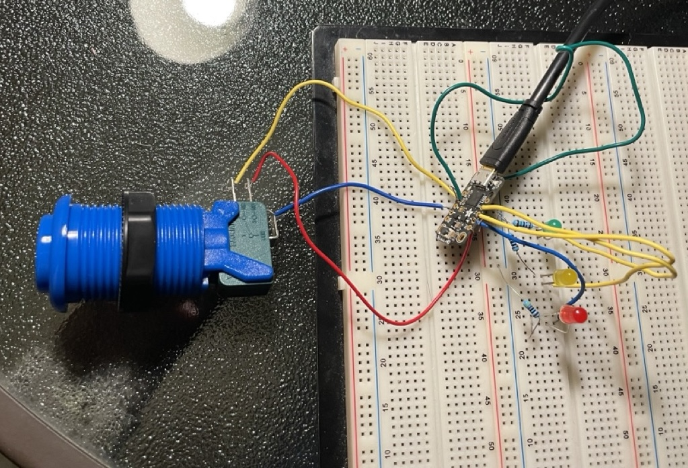
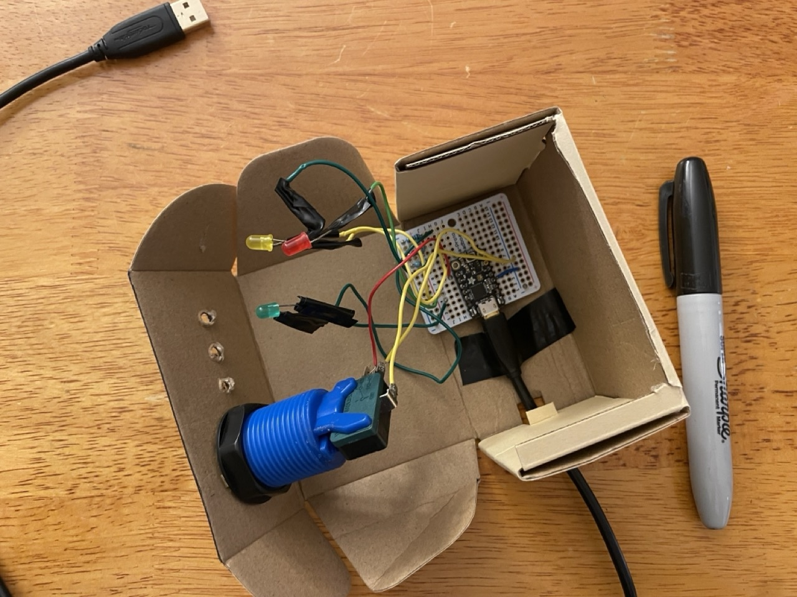
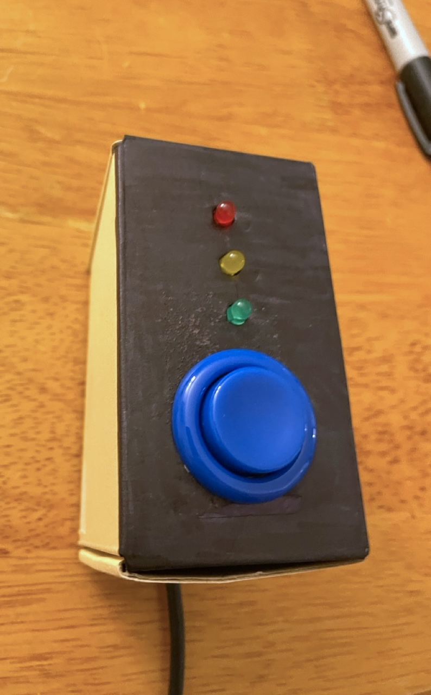

# Simple button-box timer

_Project write-up here: [Button-box timer](https://www.hannahilea.com/blog/button-box-timer)_

A "get up and stretch!" timer box, to be installed out of reach but within immediate eyesight of its oft-seated user, who must then stand up to reset it. 

The timer cycles through the LEDs from green to yellow to red when the hard-coded thresholds are passed (default: 30min, 60min); the timer is reset by pushing and releasing the single button.

This repository holds the CircuitPython script and setup instructions for building a hardware timer out of an [Adafruit Trinket M0](https://www.adafruit.com/product/3500), a few LEDs, and a fun button. 

## Components

- An [Adafruit Trinket M0](https://www.adafruit.com/product/3500)
    - If you've never used one of these before, it's definitely worth a read through their excellent [set-up guide](https://learn.adafruit.com/adafruit-trinket-m0-circuitpython-arduino)
    - You could also use any other board you have lying around that runs CircuitPython (e.g., any of the Adafruit boards, really!). This is what I had, and also, it's one of the cheapest of the options. This project is super basic, don't waste an interesting board on it if you don't have to!
- A power source for the Trinket
    - I used a micro USB cable + wall wart, but you could alternatively use a power brick of some sort or a lipoly battery.
- One button (or other physical input sensor)
    - I used an arcade-style button from Adafruit, but any button will do
- 3 LEDs (red, green, yellow) with one 100Ω resistor each (well, I used a 430Ω resistor for my red LED, but it really doesn't matter!)
    - The LEDs could easily be swapped out with e.g. a neopixel (or many) or some other indicator light or sound. These happen to be what I had on hand.
- (Optional) A small prototyping board, for soldering everything together (...plus soldering gear)
    - Or a breadboard, if you aren't making something semi-permanent.

### Trinket M0 set-up

1. Follow the [Adafruit tutorial](https://learn.adafruit.com/adafruit-trinket-m0-circuitpython-arduino/circuitpython) to update your Trinket M0 board to CircuitPython 9.2.8.

2. Replace the default `code.py` on the board with the [`code.py`](./code.py) found in this repository.

3. Optional: Depending on what time durations you want your timer to switch to the yellow and then red light, update `THRESHOLD_YELLOW_SEC` and `RED_THRESHOLD_SEC` at the top of the file. 

4. Optional: Depending on how you wired your button, you may need to invert the "is pushed" value in code. To do this, change the two callsites that say `[...] not button.value` to `[...] button.value`.

### Physical assembly

Based on the Trinket M0's [pinout](https://learn.adafruit.com/adafruit-trinket-m0-circuitpython-arduino/pinouts), connect your button to the D3 GPIO pin and your three LEDs to pins D0, D1, and D2, with a resistor between each LED and ground.

[TODO-future: schematic]

Solder it together onto the prototyping board, then stuff the whole shebang into a vessel of your choosing. I chose a pleasingly-sized cardboard box. 

Close it up, decorate it as you like (I used a sharpie), and you're ready to go.

🎉
